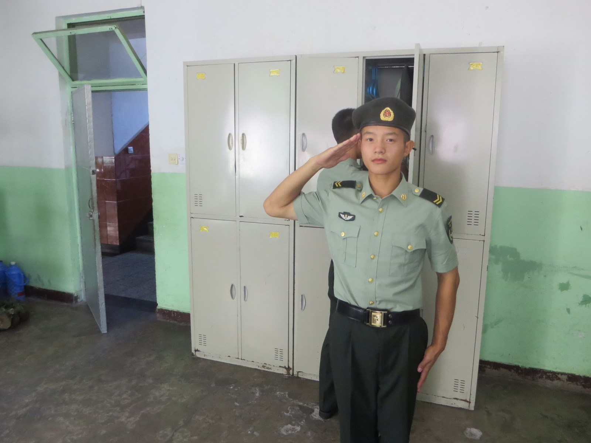

# 联系方式

- 手机：13142311551 （```湖南号码```）
- Email：550648170@qq.com
- 微信号：13142311551

---

# 个人信息

 - 李杰/男/1997 
 - 本科/陆军步兵学院 
 - 工作年限：4年
 - 期望职位：python高级程序员，架构师
 - 期望薪资：税前年薪30w~40w，根据工作内容动态浮动
 - 期望城市：上海
 - 自我介绍：
 
```
专业技能方面:
docker：
有3年容器化相关实战经验，为团队搭建持续化集成环境，将集成时间由T+1提升至T+0
python:
精通 SQL，熟练使用Python3(pandas numpy sklearn)进行数据清洗、分析
精通tornado，flask等web后端框架进行web后端开发（工业大数据）
从0到1搭建和改进测试环境，并负责项目测试工作；主导日常产品测试的全流程，包
括需求分析，测试计划，测试执行以及测试报告等工作，能够进行缺陷跟踪定位，协助开
发解决问题等
java:
熟练掌握J2EE框架技术,擅长使用Spring、SpringMVC、Mybatis等常用开源框架开发企业应用
生活中:
喜欢爬山（游侠客户外领队）, 健身（带同事俩个月健康的瘦了12斤）
```

---

# 工作经历
## 霍尼韦尔（中国）有限公司 (2018年7月 ~ 至今)
### 工作描述
参与项目的需求分析与调研并编写文档，和架构师一起进行技术选型设计解决方案，负责功能模块的开发测试运维，解决系统开发过程中遇到各类问题。


### 统一集团数据采集项目(2020/7-至今)
**项目描述**：<br/>
采集产线上的设备数据（空压机，电表，水表，融糖机，杀菌机等），将采集到的数据按照需求筛选，分类发送到云端的大数据管理系统，进行数据分析整合生成产线看板
用到技术主要有 mqtt influxdb mysql python 以及具体的采集协议如modbus rtu <br/>
**责任描述**：<br/>
参与前期项目实地调研（```查看设备型号，数量，通讯情况```），中期参与项目实施数据采集(```针对一些特殊设备(高价值老旧设备)，使用python编写对应的采集脚本```)，
后期负责系统代码编写(```利用socketio 推送关键业务数据, 使用flask+sqlalchemy+socketio 等技术编写产线小看板```)

### oss 智能网关(2019/7-至今)
**项目描述**：<br/>
oss智能网关是一款集工业大数据采集，数据筛子，数据建模分析一体的工业级网关，采用云边协作的架构，其主要分为云端管理，网关管理，边缘智能三大模块。
用到的技术主要有：emqx influxdb CockroachDB docker redis supervisor python(flask, tornado, pandas, numpy, sklearn) 等 <br/>
**责任描述**：<br/>
前期主要负责云端管理，网关管理的后台代码编写，中期修改bug，后期负责测试(```手工测试+selenium页面自动化测试``)以及网关应用系统的部署运维

### 中建钢构大数据平台(2018/9-2019/7)
**项目描述**：<br/>
中建钢构大数据分析平台通过对直接采集自设备的制造过程数据与企业ERP、BIM系统等现有业务系统数据进行有效整合，不仅可以查询任务制造进度、设备当前加工任务、实时工艺参数、能耗情况、制造过程成本情况等全过程数据，还可以通过进一步建立数据模型，深度分析计算最佳工艺参数值，实现制造精益化管理。
主要用的的技术有：emqx influxdb CockroachDB docker redis python(flask, sqlalchemy，pandas,numpy) <br/>
**责任描述**：<br/>
本人主要产线看板，作业中心，产品管理，能耗管理，成本管理等功能模块的代码编写
**项目展示**

 ### 3cf 智慧消防系统(2018/9-2019/7)
**项目描述**：<br/>

3cf 智慧消防是指利用物联网，人工智能，虚拟现实，移动互联网+,配合大数据平台进行火警智能研判。项目主要分为智慧消防管理端、智慧消防巡查端 、智慧消防指挥中心 、智慧消防应用等若干模块
Spring、SpringMVC、Mybatis三大框架技术相结合，前端采用vue框架技术，数据库采用的是轻量级的MySQL数据库。<br/>
**责任描述**：<br/>
本人主要负责协助AI工程师进行消防应用开发，消防应用管理模块的代码编写

## 湖南定向网络科技有限公司(2017年4月 ~ 2018年5月)
本人参与功能模块编码，对功能模块进行单元测试并反馈测试问题，参与修复程序BUG、参与新知识的学习和培训、完成上级交办的其他事宜

### 扬帆应用信息管理系统(2017/10-2018/3)
**项目描述**：<br/>
扬帆应用信息管理系统为Android移动端APP应用商城提供后台APP管理的企业级的CMS系统；本项目按功能可分为若干模块，主要有APP信息管理、APP版本信息管理、APP开发者信息管理、APP后台管理者信息、APP用户下载信息、权限管理、论坛管理、会员管理、积分统计、消息推送、系统设置等模块。
本项目主要采用Spring、SpringMVC、Mybatis三大框架技术相结合，前端采用Bootstrap框架技术，数据库采用的是轻量级的MySQL数据库。<br/>
**责任描述**：<br/>
本人主要负责APP信息管理模块、APP后台管理者信息模块，处理APP信息及后台管理员信息的查询录入和修改；

### 衡州电力智能设备管理网 (2017/4-2017/10)
**项目描述**：<br/>
本项目主要是针对衡阳县区供电分公司各个站点设备的运行监控和设备资源数据管理的一个B/S网站，主要包括技术设施维护管理、技术资料图纸管理、站点设备运行管理、监测台建筑管理、系统管理、审批流转管理、页面设备数据管理等功能模块；本项目使用HTML5+CSS3,JavaScript,Boostrap的前端技术构建前端框架,数据库使用的是SQL Server<\br>
后端架构pring、SpringMVC、Mybatis、java
<br/>
**责任描述**：<br/>
参与监测台建筑管理模块的编写和数据看板展示
---

## 技能清单
以下均为我熟练使用的技能
- Web开发：python/java
- Web框架：falsk/sqlalchemy
- 数据库相关：MySQL/CockroachDB/SQLite
- 版本管理、文档和自动化部署工具：/Gitlab/Jenkins/docker/JFrog Artifactory/swagger
- 单元测试：Unittest/Junit
- 云和开放平台：微信服务号开发

## 技能与专长
这些是我在过去四年左右的时间里接触过的语言，工具和实践。在我的日常工作中喜欢日常使用的那些东西用*符号表示。
- python *
- flask  *
- pandas *
- modbus_tk *
- numpy
- tornado
- sklearn
- java
- mybatis *
- springmvc *
- spring *
- gitlab *
- jenkins *
- docker *
- mysql *
- flask *
- sqlalchemy *
- CockroachDB
- linux *
- redis *
- maven *
- nginx *
- git *
---

# 致谢
感谢您花时间阅读我的简历，期待能有机会和您共事。
